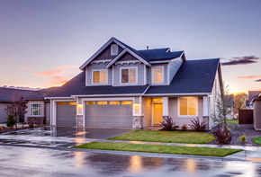

<html lang="en">
  <head>
    <title>Zurish Insurance</title>
    <!-- Required meta tags -->
    <meta charset="utf-8">
    <meta name="viewport" content="width=device-width, initial-scale=1, shrink-to-fit=no">

    <!-- Bootstrap CSS -->
    <link rel="stylesheet" href="https://stackpath.bootstrapcdn.com/bootstrap/4.3.1/css/bootstrap.min.css" integrity="sha384-ggOyR0iXCbMQv3Xipma34MD+dH/1fQ784/j6cY/iJTQUOhcWr7x9JvoRxT2MZw1T" crossorigin="anonymous">
    <link rel="stylesheet" href="css/index.css">
    <link rel="stylesheet" href="css/responsive.css">
    
    
    
    <link rel="stylesheet" href="https://cdnjs.cloudflare.com/ajax/libs/animate.css/3.7.2/animate.min.css">
    <link rel="stylesheet" href="https://cdnjs.cloudflare.com/ajax/libs/font-awesome/4.7.0/css/font-awesome.css">
    <link rel="stylesheet" href="https://cdnjs.cloudflare.com/ajax/libs/font-awesome/4.7.0/css/font-awesome.min.css">

</head>
<body >
    
  

    

    
    

    

    
  

  

  

    <!--Navbar-->
      <header class="header_wrapper">
            <nav class="navbar navbar-expand-lg navbar-light fixed-top">
            <a class="navbar-brand" href="#">Zurish Insurance</a>
            <button class="navbar-toggler" type="button" data-toggle="collapse" data-target="#navbarNav" aria-controls="navbarNav" aria-expanded="false" aria-label="Toggle navigation">
              
            </button>
            

              <ul class="navbar-nav ml-auto ">
                <li class="nav-item">
                  <a class="nav-link" href="index.html">Home</a>
                </li>
                <li class="nav-item">
                  <a class="nav-link" href="about.html">About</a>
                </li>
                <li class="nav-item">
                  <a class="nav-link" href="services.html">Services</a>
                </li>
                <li class="nav-item">
                    <a class="nav-link" href="blog.html">Blog</a>
                  </li>
                  <li class="nav-item">
                    <a class="nav-link" href="portfolio.html">Portfolio</a>
                  </li>
              </ul>
              <ul class="navbar-nav">
                <li class="nav-item text-center">
                    <a class="nav-link learn-more-btn" href="contact.html">Contact Us</a>
                </li>
            </ul>
            

          </nav>
      </header>
    <!--Navbar end-->

         <!--slider head-->
            

              

                <!-- Indicators -->
                <ul class="carousel-indicators">
                  <li data-target="#demo" data-slide-to="0" class="active"></li>
                  <li data-target="#demo" data-slide-to="1"></li>
                  <li data-target="#demo" data-slide-to="2"></li>
                </ul>
              
                <!-- The slideshow -->
                

                  

                    

                      

                        

                          

                            <h6 class="animated fadeInLeft">INSURANCE SOLUTION</h6>
                            
Insurance for any purpose

                            
Only our company gives you an investment with your life   insurance policy at no

                            <a class="animated fadeInUp btn delicious-btn" href="#">Contact Us</a>
                          

                        

                      

                    

                  

                  

                  

                    

                      

                        

                          

                            <h6 class="animated fadeInLeft">INSURANCE SOLUTION</h6>
                            
Insurance for any purpose

                            
Only our company gives you an investment with your life   insurance policy at no

                            <a class="animated fadeInUp btn delicious-btn" href="contact.html">Contact Us</a>
                          

                        

                      

                    

                  

                  
                  

                  

                    

                      

                        

                          

                            <h6 class="animated fadeInLeft">INSURANCE SOLUTION</h6>
                            
Insurance for any purpose

                            
Only our company gives you an investment with your life   insurance policy at no

                            <a class="animated fadeInUp btn delicious-btn" href="contact.html">Contact Us</a>
                          

                        

                      

                    

                  

                
          
                <!-- Left and right controls -->
                <a class="carousel-control-prev" href="#demo" data-slide="prev">
                  
                </a>
                <a class="carousel-control-next" href="#demo" data-slide="next">
                  
                </a>
              

              <!--slider head end-->

             <!-- why choose card -->
              

                

                  

                    

                      <h4>Why ChooseUs</h4>
                      
My choice 
                        is a managed care organization with a passion for putting our members first. .

    
                    

                    

                      
<i class="fa fa-hourglass-half 7x" style="color: black;" aria-hidden="true"></i>
                        <h6>Save your Money</h6>
                        
 Car Insurance believes that purchasing <a href="car.html">car Inusurance</a>should be as easy as purchasing anything else online. To make this a reality.

                      

                    

                    

                      
<i class="fa fa-pencil-square-o 7x" style="color:black;" aria-hidden="true"></i>
                        <h6>Get Free Quote</h6>
                        
Contact us   
                          through our webpage and contact number for more knowledge and advices,we guide you the best solution of your problems.

                      

                    

                    

                      
<i class="fa fa-home 7x" style="color:black;" aria-hidden="true"></i>
                        <h6>Fast & reliable</h6>
                        
We recommend the best insurance 
                          it seems like everything can be done online, from visiting with your doctor 

                      

                    

                  

                

              

                <!-- why choose card end -->

               <!-- banner wrapper -->
              <section class="banner_wrapper">
                

                    

                        

                            
                        

                        

                            
INSURANCE SOLUTION

                            <h1 class="banner-title">Insurance for any purpose</h1>
                            
Only our company gives you an investment with your life   insurance policy at no extra cost

                            

                              <a href="about.html" class="btn btn-primary btn-lg active" role="button" style="background-color: darkcyan ; border-color:#fff;" aria-pressed="true">Discover More</a>
                            

                        

                    

                

                
            </section>
            <!-- banner wrapper end -->
            
            <!-- All insurance card -->
            

              

                <h2>We’re covering all the insurance fields</h2>
              

              

                

                  

                    
                    

                      <h5 class="card-title">Car Insurance</h5>
                      
Some quick example text to build on the card title and make up the bulk of the card's content.

                      <a href="car.html" class="btn " style="background-color: rgb(63, 114, 134) ; border-color:#fff; color: #fff;">Learn More</a>
                    

                  

                

                

                  

                    
                    

                      <h5 class="card-title">Life Insurance</h5>
                      
Some quick example text to build on the card title and make up the bulk of the card's content.

                      <a href="" class="btn" style="background-color: rgb(63, 114, 134) ; border-color:#fff; color: #fff;">Learn More</a>
                    

                  

                

                

                  

                    
                    

                      <h5 class="card-title">Home Insurance</h5>
                      
Some quick example text to build on the card title and make up the bulk of the card's content.

                      <a href="home.html" class="btn" style="background-color: rgb(63, 114, 134) ; border-color:#fff; color: #fff;">learn More</a>
                    

                  

                

                

                  

                    
                    

                      <h5 class="card-title">Health Insurance</h5>
                      
Some quick example text to build on the card title and make up the bulk of the card's content.

                      <a href="health.html" class="btn" style="background-color: rgb(63, 114, 134) ; border-color:#fff; color: #fff;">learn More</a>
                    

                  

                

                

                  

                    
                    

                      <h5 class="card-title">Travel Insurance</h5>
                      
Some quick example text to build on the card title and make up the bulk of the card's content.

                      <a href="#about" class="btn" style="background-color: rgb(63, 114, 134) ; border-color:#fff; color: #fff;">learn More</a>
                    

                  

                

                

                  

                    
                    

                      <h5 class="card-title">Fire Insurance</h5>
                      
Some quick example text to build on the card title and make up the bulk of the card's content.

                      <a href="#about" class="btn" style="background-color: rgb(63, 114, 134) ; border-color:#fff; color: #fff;">learn More</a>
                    

                  

                

                

                  

                    
                    

                      <h5 class="card-title">Marrige Insurance</h5>
                      
Some quick example text to build on the card title and make up the bulk of the card's content.

                      <a href="#about" class="btn" style="background-color: rgb(63, 114, 134) ; border-color:#fff; color: #fff;">learn More</a>
                    

                  

                

                

                  

                    
                    

                      <h5 class="card-title">Business Insurance</h5>
                      
Some quick example text to build on the card title and make up the bulk of the card's content.

                      <a href="#about" class="btn" style="background-color: rgb(63, 114, 134) ; border-color:#fff; color: #fff;">learn More</a>
                    

                  

                

              

            

     <!-- All insurance card end -->

        
     <section class="choose_wrapper">
      

        
      

      

        

            

                
            

            

                
WHY CHOOSE

                <h1 class="banner-titlechoose">Few reasons for people choosing   Zurish insurance</h1>
                
Only our company gives you an investment with your life   insurance policy at no extra cost

                

                  <a href="#about" class="btnchoose btn-primary btn-lg active" role="button" style="background-color: darkcyan ; border-color:#fff;" aria-pressed="true">Discover More</a>
                

            

        

    

  </section>
       <!-- Form start -->
          <section class="form_wrapper">
              

                
              

              

                

                    

                      
                        
                    

                    

                      
GET A FREE ESTIMATE

                        <h1 class="banner-titleform">Get an insurance quote to   get started!</h1>
                       
                      <form>
                        

                          <label for="exampleFormControlInput1"></label>
                          <input type="email" class="form-control" id="exampleFormControlInput1" placeholder="Enter Email">
                        

                        

                          <label for="exampleFormControlInput1"></label>
                          <input type="password" class="form-control" id="exampleFormControlInput1" placeholder="Enter Password">
                        

                        
                        

                          <label for="exampleFormControlSelect2"  placeholder="Select Insurance"></label>
                          <select  class="form-control" id="exampleFormControlSelect2">
                            <option value="select insurance">select Insurance</option>
                            <option value="car Insurance">Car Insurance</option>
                            <option value="life Insurance">Life Insurance</option>
                            <option value="home Insurance">Home Insurance</option>
                            <option value="health Insurance">Health Insurance</option>
                            <option value="travel Insurance"> Travel Insurance</option>
                          </select>
                        

                        

                          <a href="#about" class="btnforms btn-primary btn-lg active" role="button" style="background-color: darkcyan ; border-color:#fff;" aria-pressed="true">Discover More</a>
                        

                      </form>
                       
                        

                    

                

            

          </section>
            <!-- Form start end -->

             <!-- Counter start -->
         

          

          

            

              

                <h2 class="counter">2.6k</h2>
                <h4>Gave insurances</h4>
              

            

            

              

                <h2 class="counter">89+</h2>
                <h4>Professional team</h4>
              

            

            

              

                <h2 class="counter">2.8k</h2>
                <h4>Satisfied customers</h4>
              

            

            

              

                <h2 class="counter">99%</h2>
                <h4>Our success rate</h4>
              

            

          

         

            

           <!-- Counter start end -->

            <!-- Footer start -->

           <footer class="footer">
            

              

                

                  <h4>Zurish Insurance</h4>
                  <ul>
                    <li>Home</li>
                    <li>About</li>
                    <li>Services</li>
                    <li>Blog</li>
                    <li>Portfolio</li>
                    <li>Contact Us</li>
                  </ul>
                

                

                  <h4>Follow us</h4>
                  

                    <a href="https://www.facebook.com/"><i class="fa fa-facebook-square" aria-hidden="true"></i></a>
                    <a href="https://www.instagram.com/accounts/login/"><i class="fa fa-instagram" aria-hidden="true"></i></a>
                    <a href="https://twitter.com/i/flow/login?input_flow_data=%7B%22requested_variant%22%3A%22eyJsYW5nIjoiZW4ifQ%3D%3D%22%7D"><i class="fa fa-twitter-square" aria-hidden="true"></i></a>
                    <a href="https://www.linkedin.com/login"><i class="fa fa-linkedin-square" aria-hidden="true"></i></i></a>
                    
                  

                  
                

                  
              
                

                        
                  

                    <label class=" text-white " for="inputEmail4">Email Address:</label>
                      
                    <input type="email" class="form-control" id="inputEmail4" placeholder="Email@">
                  

                  <button type="submit" class="btn btn-outline-info btn-block ">Submit</button>
              

              
            

           </footer>
           <!-- Footer end -->

           

          

            

           
      
    <!-- Optional JavaScript -->
    <!-- jQuery first, then Popper.js, then Bootstrap JS -->
    
    
    
    <!--owl carousel js-->
    
     

    
  </body>
</html>
